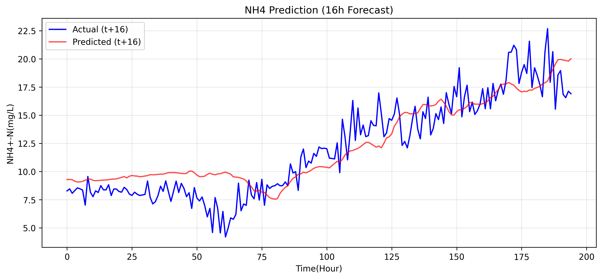
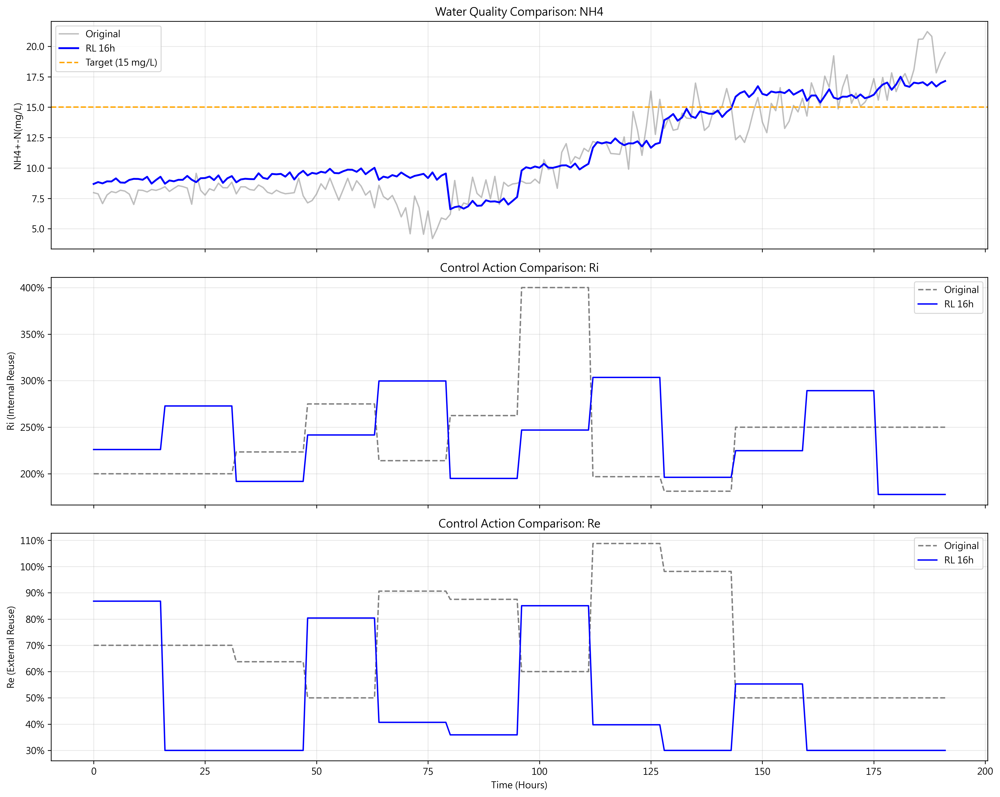
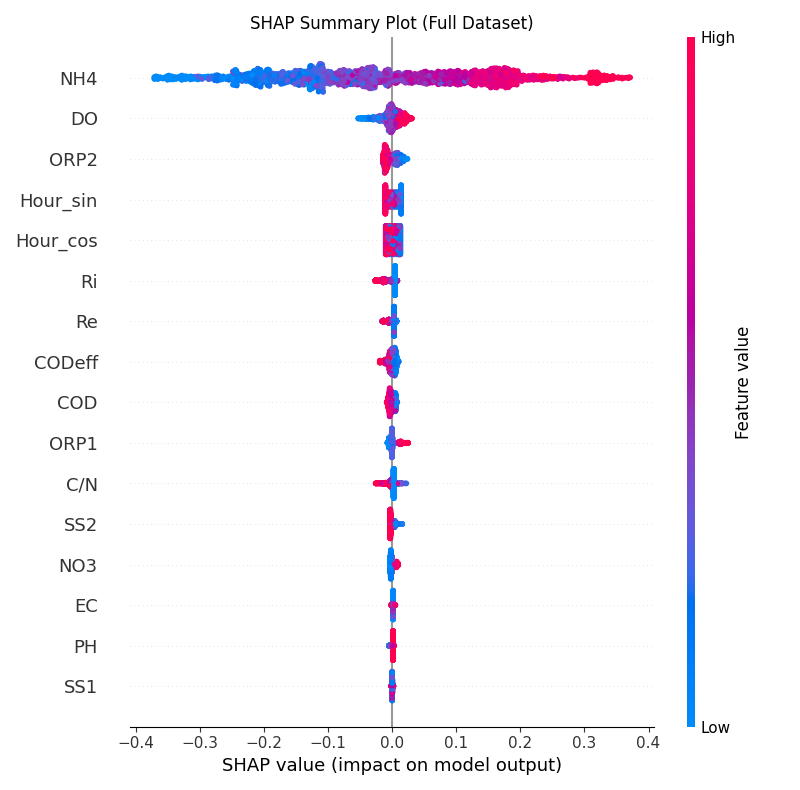
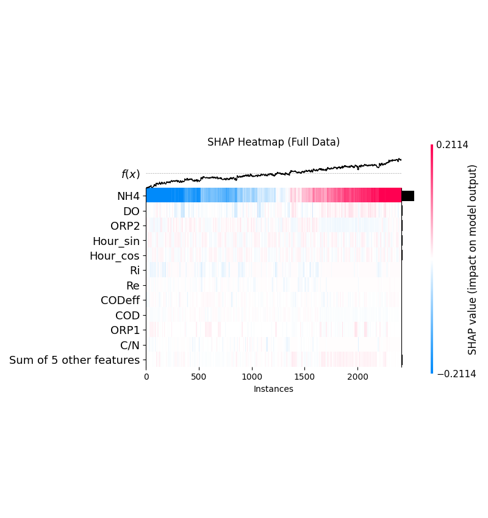

# 污水處理預測與強化學習最佳化系統 (Wastewater Treatment RL Optimization)

## 📖 專案簡介 (Project Overview)
本專案結合了深度學習 (Deep Learning) 與強化學習 (Reinforcement Learning) 技術，旨在為污水處理廠建立一套智慧決策輔助系統。透過長短期記憶神經網路 (LSTM) 對放流水質（NH4 濃度）進行精準預測，並利用 Proximal Policy Optimization (PPO) 強化學習代理人自動尋找最佳的操作參數配置（內迴流比 Ri 與外迴流比 Re），在確保水質符合法規標準的前提下，實現廠區操作的最佳化。

---

## 🚀 目前成果 (Current Achievements)

### 1. LSTM 出流水質預測 (NH4 Prediction)
我們建構了 LSTMS2S (Sequence-to-Sequence LSTM) 模型，根據過去的歷史水質與操作變數，成功預測未來 16 小時的放流 NH4 濃度。
> **備註**：開發過程中亦有針對 COD 進行建模，但因預測效能不佳已暫時放棄。目前後續的強化學習與最佳化皆完全專注於 **NH4 (氨氮)** 指標。

*(圖：LSTM 模型針對 NH4 出水濃度的預測值與實際觀測值對比)*

### 2. 強化學習操作參數最佳化 (RL Optimization with PPO)
開發了基於 PPO 演算法的強化學習代理人，用於動態調整操作參數。實驗中對比了兩種控制策略的表現：
*   **16 小時控制策略 (Primary Practical Focus)**：主要實務操作策略。考量到真實污水廠操作的人力與反應時間，以每 16 小時調整一次參數為基準。
*   **1 小時控制策略 (Ideal Baseline)**：理論理想對照組。以極高頻率（每小時）調整參數，作為評估 16 小時策略效能差距的理想基準。

*(圖：不同 RL 代理人在改變 Ri, Re 參數時，對於 NH4 濃度控制效果的比較)*

### 3. 可解釋性人工智慧分析 (Explainable AI - SHAP)
為了解開 LSTM 神經網路的黑盒子，我們導入了 SHAP (SHapley Additive exPlanations) 分析，提取影響放流 NH4 濃度的關鍵特徵，幫助我們理解各項水質參數與操作條件對最終結果的貢獻度。

*(圖：全局特徵重要性，顯示哪些變數對 NH4 預測的影響最為顯著)*

*(圖：特徵影響的熱力圖分佈)*

---

## 🔮 未來展望與開發計畫 (Future Plans)

### 廠區操作員決策儀表板 (Operator Web Dashboard) - *開發中*
雖然後端模型已有良好的預測與最佳化能力，但為了讓污水處理廠的現場操作人員能更直覺地使用這套系統，我們目前正在開發一個單頁式的互動網頁前端介面。

該儀表板將具備以下核心功能：
1.  **即時狀態監控**：清楚呈現廠區當下所有的水質測項指標，以及現在的操作條件 (Ri, Re)。
2.  **雙情境預測對比**：
    *   **維持現狀 (Current Parameters)**：顯示若不改變當前操作條件，未來 16 小時的出流 NH4 預測結果。
    *   **AI 建議 (RL Recommended Parameters)**：顯示強化學習代理人建議的最佳 Ri、Re 參數，以及若採納該建議後，未來 16 小時的出流 NH4 預測結果。
3.  **目標效益**：使操作員能一目了然現階段廠區狀況與可能面臨的風險，並透過並排比較 (Side-by-Side) 快速評估 AI 的建議，提升決策效率。

---

## 💻 環境設定與執行方式 (Environment & Execution)

為確保開發與運作環境的一致性，本專案的所有操作與執行均嚴格規範於 Anaconda 的 `DRL` 虛擬環境中進行，並具備標準化的交班日誌流程：

1.  **開啟工作**：執行 `./start.sh`
    *   自動啟用 `DRL` 環境，並讀取上一次開發者的「交班日誌」，快速掌握專案進度。
2.  **結束工作**：執行 `./ending.sh`
    *   備份歷史紀錄，並透過終端機引導撰寫本次工作進度與下次待辦事項 (`handover_log.txt`)，完成交班。
